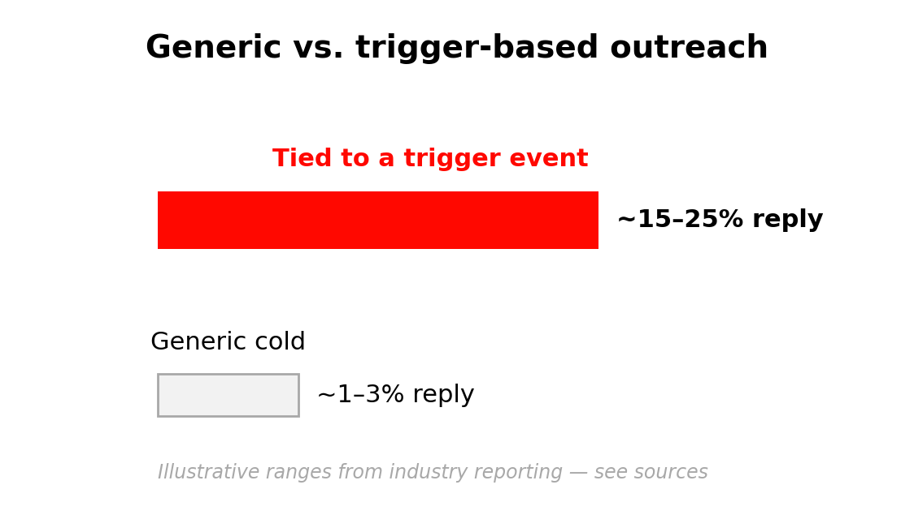

# 💡 Daily Digest — The Email That Wins Is Usually the Fastest

*Trigger-based outreach consistently out-replies generic cold outreach.*

---

## The Hook

Two reps send a near-identical email to the same company. One sends it the week the company announces a funding round; the other sends it a month later. The first rep is dramatically more likely to get a reply — and it has almost nothing to do with the words.

---

## The Story

Sales teams have measured this for years, and the pattern is remarkably consistent: outreach tied to a real **trigger event** — a funding round, a leadership hire, an expansion — pulls far higher reply rates than the same message sent cold. Industry reporting puts trigger-based reply rates in the **15–25%** range versus roughly **1–3%** for generic cold outreach.

The reason is timing. A trigger event is a moment when a company suddenly has a new problem *and* fresh budget or pressure to act. A retailer that just opened a second warehouse is, right then, feeling the strain of multi-site logistics. Reach them in that window and your message reads as relevant. Reach them three months later and the urgency has cooled.

Speed compounds the effect. The first credible seller to act on a trigger has a strong advantage, and reply rates fade week over week after the event fires. So the win isn't just "personalize" — it's "personalize *fast*."

This is exactly why AI matters for prospecting. The bottleneck was never writing the email; it was noticing the trigger in time. AI assistants can scan company news, press releases, and announcements in seconds, so you can catch the moment while the window is still open — then verify it and reach out the same day.

| | Generic cold outreach | Trigger-based outreach |
|---|---|---|
| Typical reply rate | ~1–3% | ~15–25% |
| Relevance to buyer | Low | High (tied to a real change) |
| Best time to send | Anytime (low impact) | Within days of the trigger |

---

## Why This Matters for You

The lesson of the day — research, spot the trigger, personalize — isn't just about quality, it's about *timing*. The reps who win with AI use it to shorten the gap between "something changed at this account" and "I reached out about it." Speed, backed by a verified signal, is the edge.

---

## Sources

- [Funding Events as Sales Triggers — Launch Leads](https://www.launchleads.com/lead-generation-strategies/funding-events/)
- [Sales Trigger Events 2026: Complete Guide — Growth List](https://growthlist.co/sales-trigger-events/)
- [40 Sales Statistics to Watch — Salesforce](https://www.salesforce.com/sales/state-of-sales/sales-statistics/)
