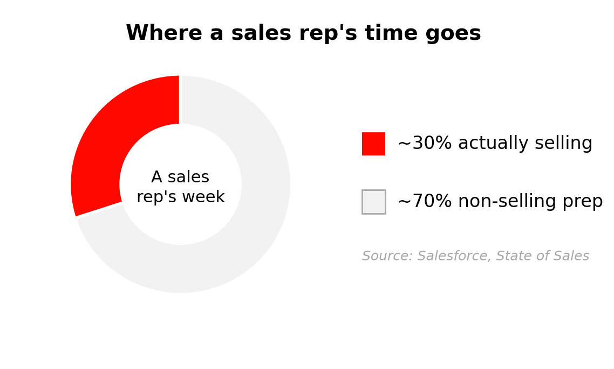
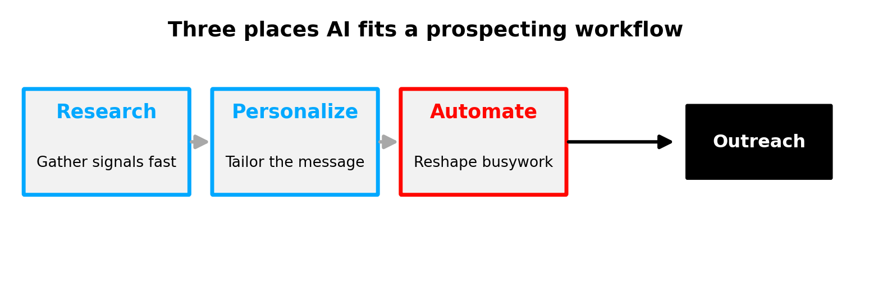

# The AI Paradigm Shift in Sales

### 👩‍🏫 👩🏿‍🏫 What You'll learn

- Explain how AI changes the economics of selling time
- Identify where AI helps in a sales workflow — and where it shouldn't
- Decide which of your own tasks are good candidates to hand to an AI assistant

---

## Introduction

Here is an uncomfortable number: most sales reps spend only about a third of their working week actually selling. Salesforce's State of Sales research found reps spend roughly **70% of their time on non-selling work** — research, CRM updates, internal meetings, and chasing bad data — and only about **30% talking to buyers**. That is the single biggest leak in most sales teams, and it has nothing to do with talent or effort.

AI changes that math. Not by replacing the seller, but by absorbing the slow, repetitive prep work that eats the other 70%. The reps who win with AI are not the ones who automate everything — they are the ones who hand the right tasks to the machine and keep the human parts for themselves.

This lesson sets the foundation for everything that follows: what AI is genuinely good at in a sales context, what it is bad at, and how to spot the tasks worth delegating.

### 💼 Prerequisites

- Basic familiarity with a sales workflow (prospecting, outreach, follow-up)

### Useful Resources

| Resource | Link | Type |
|---|---|---|
| Salesforce State of Sales research | https://www.salesforce.com/news/stories/sales-research-2023/ | Article |
| Introducing Researcher and Analyst in Microsoft 365 Copilot | https://www.microsoft.com/en-us/microsoft-365/blog/2025/03/25/introducing-researcher-and-analyst-in-microsoft-365-copilot/ | Article |

---

## Where your selling time actually goes

Think about a normal Tuesday. You might open five browser tabs to research one account, update the CRM after a call, reformat a deck for a different buyer, and write three follow-up emails from scratch. None of that is selling. It is the *scaffolding around* selling — necessary, but slow.

*Most reps spend about 70% of the week on non-selling work. Source: Salesforce, State of Sales.*

AI is good at exactly this kind of work: reading a lot of text fast, summarizing it, drafting a first version, and reshaping content for a new audience. It is a tireless junior teammate who never gets bored of the prep. What it is *not* is the closer, the relationship, or the judgment call. Keep those.

| What AI is great at | What stays human |
|---|---|
| Reading and summarizing company news, reviews, reports | Building trust in a live conversation |
| Drafting a first version of an email or summary | Reading the room and timing the ask |
| Reshaping a message for a different persona | Negotiating price and terms |
| Surfacing possible decision-makers to verify | The final decision on who and when to contact |

> **Knowledge Check — Selling vs. non-selling time**
>
> *Think about:* "Of the tasks you did yesterday, which were actual selling, and which were prep work an assistant could have started for you?"
>
> *Quick activity (2 min):* Write down three tasks from your last working day. Mark each one "human" or "AI could help."

---

## The three places AI fits a sales workflow

Across prospecting, AI tends to add value in three repeatable spots. Keep these in mind — the rest of the day maps directly onto them.

*The three places AI most reliably saves a seller time.*

**Research.** Instead of juggling LinkedIn, news sites, and spreadsheets, you ask focused questions ("What recent news mentions this company?", "Who leads marketing here?") and get the signals in one view. You stay the decision-maker; the AI just gathers raw material.

**Personalize.** AI takes a research insight — a funding round, a new hire — and helps you turn it into an opening line that feels tailored instead of templated. The product stays the same; the story changes for the listener.

**Automate.** The repetitive shaping work — turning notes into a summary, a summary into a draft email, a draft into three persona variants — is where AI quietly gives you hours back.

> **Real-World Example — Microsoft 365 Copilot**
>
> Microsoft built research directly into its sales workflow with the **Researcher** agent in Microsoft 365 Copilot, which combines a deep-research model with access to your files, emails, and the web to produce a structured, source-cited report. It became generally available in June 2025 — a sign that "AI does the prep, the seller does the selling" is now a mainstream product pattern, not an experiment.
>
> *Source: https://www.microsoft.com/en-us/microsoft-365/blog/2025/06/02/researcher-and-analyst-are-now-generally-available-in-microsoft-365-copilot/*

> 📌 **Common Misconception**
>
> *"AI will replace salespeople."*
>
> **Reality:** AI replaces *tasks*, not roles. It is excellent at the prep work that surrounds a deal, but it cannot build trust, read a hesitant buyer, or own a number. The reps who thrive point it at their worst time-sinks — not as a substitute for the conversation.

> **Knowledge Check — The three fits**
>
> *Think about:* "Which of the three — research, personalize, automate — would save *you* the most time this week?"
>
> *Quick activity (2 min):* Pick one and name the exact task you'd hand over first.

---

## Knowing what NOT to delegate

The fastest way to get burned by AI in sales is to trust it blindly. AI models can state a wrong fact with total confidence — an invented job title, an outdated funding figure, a competitor claim that isn't true. In sales, sending that to a buyer costs trust you can't easily win back.

The rule for this whole course: **AI drafts and gathers; you verify and decide.** Treat every AI output as a confident first draft from a fast junior teammate — useful, but never sent without a human check. When AI surfaces a decision-maker, confirm the name. When it cites a "recent" event, check the date and source before you reference it in outreach.

| Task | Hand to AI? | Why |
|---|---|---|
| Summarize a company's last 6 months of news | ✅ Yes, then verify dates | Fast, but can mix up timing |
| Draft a cold email from a research insight | ✅ Yes, then edit voice | Saves the blank-page problem |
| Confirm a prospect's exact current title | ⚠️ Use as a lead, verify on the source | AI can hallucinate roles |
| Decide whether to discount a deal | ❌ No | Judgment, strategy, relationship |

> **Knowledge Check — The verify habit**
>
> *Think about:* "What is the worst thing that could happen if you sent an AI-written claim to a buyer without checking it?"
>
> *Quick activity (2 min):* Write one sentence describing how you'll verify AI research before it reaches a prospect.

---

## 🚀 Lesson Challenge

Map your own week to the AI workflow.

**What to do:**
1. List five recurring tasks from a typical sales week (e.g., "research a new account," "write follow-up emails").
2. For each, label it **Research**, **Personalize**, **Automate**, or **Keep Human**.
3. Pick the one task that costs you the most time and write one sentence on how you'd ask an AI to start it for you.

*A brief solution for this challenge is available in the solutions file.*

---

## Key Takeaways

| # | Takeaway |
|---|---|
| 1 | Reps spend ~70% of their time not selling; AI's value is absorbing that prep work, not replacing the seller. |
| 2 | AI fits sales in three repeatable spots: research, personalize, and automate. |
| 3 | AI drafts and gathers; you verify and decide — never send an unchecked AI claim to a buyer. |
