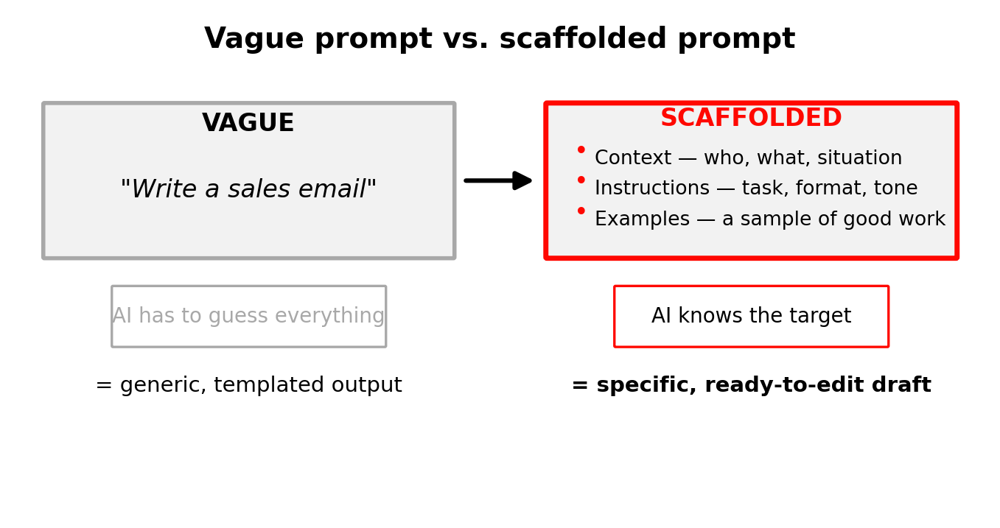

# Coach the AI, Don't Just Ask It

### 👩‍🏫 👩🏿‍🏫 What You'll learn

- Explain why vague prompts produce vague, generic AI output
- Build a scaffolded prompt using context, instructions, and examples
- Apply scaffolding to a real prospecting task

---

## Introduction

Imagine hiring a new sales rep and giving them no instructions — no product training, no idea who the customer is, no example of a good email. They would flounder. AI is the same. It works best when you coach it, not when you toss it a one-line request and hope.

The difference between a disappointing AI answer and a genuinely useful one is rarely the model. It is the prompt. A **prompt** is simply the instruction you give the AI. Most people write prompts like a hurried Google search ("write a sales email") and get back something bland that screams "template." The fix is a technique called **prompt scaffolding**: giving the AI a clear framework instead of a vague wish.

This is the conceptual key to the whole course. Get this right and every later task — research, personalization, outreach — gets dramatically better.

### 💼 Prerequisites

- Access to any AI assistant to try the prompts (recommended)

### Useful Resources

| Resource | Link | Type |
|---|---|---|
| Microsoft — Get started with Researcher in Microsoft 365 Copilot | https://support.microsoft.com/en-us/microsoft-365-copilot/get-started-with-researcher-in-microsoft-365-copilot | Documentation |

---

## Why vague prompts fail

When you type "write a cold email," the AI has to guess everything: who the buyer is, what you sell, the tone, the length, the goal. It fills those gaps with the most average answer it can produce — which is exactly why the result feels generic. The AI isn't being lazy; you simply didn't tell it what "good" looks like.

A good prompt removes the guesswork. The more relevant detail you give, the less the AI has to invent, and the closer the first draft lands to something you'd actually send.

> 📌 **Common Misconception**
>
> *"A better AI model would fix my bad output."*
>
> **Reality:** Most weak output comes from weak prompts, not weak models. The same assistant that wrote a generic email will write a sharp one if you give it context, clear instructions, and an example. Coaching beats upgrading.

> **Knowledge Check — Spot the gap**
>
> *Think about:* "If you gave the prompt 'write a sales email' to five colleagues, how different would their results be — and why?"
>
> *Quick activity (2 min):* Write down three things the AI would have to *guess* if you gave it only "write a sales email."

---

## The three pillars of scaffolding

Prompt scaffolding means including three things every time: **context**, **instructions**, and **examples**. Think of it as the briefing you'd give a new teammate before they touch your accounts.

*A scaffolded prompt replaces guesswork with context, instructions, and examples.*

| Pillar | What it answers | Example |
|---|---|---|
| **Context** | Who, what, and the situation | "I sell freight-management software to mid-size retailers. My prospect just opened a second warehouse." |
| **Instructions** | The task, format, length, tone | "Write a 90-word cold email, friendly but direct, ending with a soft question." |
| **Examples** | What 'good' looks like | "Match the tone of this email I've sent before: [paste example]." |

Here is the same request, before and after scaffolding:

| Vague prompt | Scaffolded prompt |
|---|---|
| "Write a sales email." | "You're helping me, a rep selling freight-management software to mid-size retailers. My prospect, an Operations Director, just announced a second warehouse. Write a 90-word cold email: warm but direct, reference the expansion, focus on reducing shipping errors during growth, and end with a low-pressure question. Match the tone of this past email: [paste]." |

The second prompt takes thirty extra seconds to write and saves you ten minutes of rewriting a flat draft.

> **Real-World Example — Microsoft 365 Copilot Researcher**
>
> Microsoft's Researcher agent is built around this same idea. Before it runs a long research task, it often asks you clarifying follow-up questions — effectively pulling the missing context out of you so its report is sharp instead of generic. The product is doing your scaffolding for you, because scaffolded inputs produce better outputs.
>
> *Source: https://techcommunity.microsoft.com/blog/microsoft365copilotblog/researcher-agent-in-microsoft-365-copilot/4397186*

> **Knowledge Check — Build a pillar**
>
> *Think about:* "Which pillar do you most often skip — context, instructions, or examples?"
>
> *Quick activity (2 min):* Take any task you'd give an AI today and write one strong sentence of *context* for it.

---

## A reusable scaffolding recipe

You don't need to reinvent the prompt each time. A simple, repeatable structure works for almost any sales task:

1. **Role** — tell the AI who it is helping ("You're assisting a B2B sales rep…").
2. **Context** — the company, product, prospect, and situation.
3. **Task** — what you want, in plain terms.
4. **Format & tone** — length, structure, voice.
5. **Example** — paste a sample of good work, if you have one.
6. **Constraints** — what to avoid ("no jargon," "don't invent statistics").

The last constraint matters in sales specifically: telling the AI **"don't invent facts — if you're unsure, say so"** is one of the most valuable single lines you can add, because it reduces confident-but-wrong claims you might otherwise send to a buyer.

### Recommended Video

| Video | Duration | Why Watch |
|---|---|---|
| [Prompt Engineering Tutorial – Master ChatGPT and LLM Responses](https://www.youtube.com/watch?v=_ZvnD73m40o) | ~41 min | Walks through context, instruction, and example prompting with side-by-side results. |

> **Knowledge Check — The anti-hallucination line**
>
> *Think about:* "Why is 'don't invent facts, say so if unsure' more important in sales than in, say, brainstorming blog titles?"
>
> *Quick activity (2 min):* Add a constraint line to a prompt you'd realistically use this week.

---

## 🚀 Lesson Challenge

Rewrite a weak prompt into a scaffolded one.

**What to do:**
1. Start from this weak prompt: *"Write a follow-up email to a prospect."*
2. Rewrite it using the six-part recipe (role, context, task, format & tone, example, constraints). Invent realistic details: you sell a scheduling tool to dental clinics, and the prospect went quiet after a demo.
3. Underline the one constraint you added to reduce made-up claims.

*A brief solution for this challenge is available in the solutions file.*

---

## Key Takeaways

| # | Takeaway |
|---|---|
| 1 | Vague prompts force the AI to guess, which produces generic output — the prompt is usually the problem, not the model. |
| 2 | Scaffolding = context + instructions + examples; a reusable recipe is role, context, task, format/tone, example, constraints. |
| 3 | In sales, always add a constraint telling the AI not to invent facts and to flag uncertainty. |
