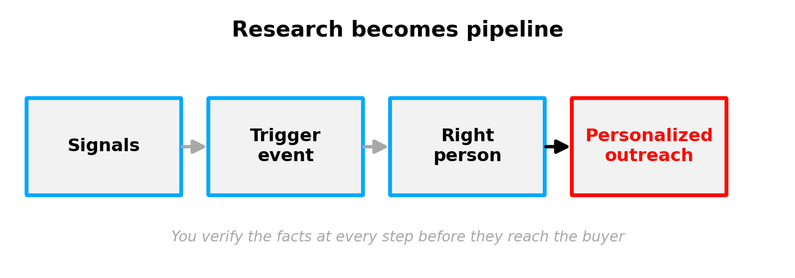

# From Research to Personalized Outreach

### 👩‍🏫 👩🏿‍🏫 What You'll learn

- Use AI to research an account and spot trigger events
- Identify the right decision-maker to contact
- Turn a research insight into a personalized opening line

---

## Introduction

Every strong sales motion starts with research — and it's the step most reps skip, because it takes time. That's a problem, because first impressions decide how a buyer sees you. Show up with context and your outreach feels tailored. Show up generic and you look rushed, which costs trust before the conversation even starts.

AI changes the time equation. The research that used to mean ten browser tabs and a spreadsheet can now happen in minutes, which means you can actually do it every time. This lesson walks the full path: research an account, catch the right moment, reach the right person, and turn what you learn into an opener that earns a reply.

### 💼 Prerequisites

- Lesson on prompt scaffolding (context + instructions + examples) is assumed knowledge

### Useful Resources

| Resource | Link | Type |
|---|---|---|
| Salesforce — 40 Sales Statistics to Watch | https://www.salesforce.com/sales/state-of-sales/sales-statistics/ | Article |
| Funding Events as Sales Triggers | https://www.launchleads.com/lead-generation-strategies/funding-events/ | Article |

---

## AI as your research buddy

Normally, researching an account means juggling LinkedIn, several Google tabs, and a notes doc. With an AI assistant, you can ask focused questions and get the signals in one place:

- "What recent news mentions this company?"
- "Who are the marketing leaders at this organization?"
- "What challenges typically face companies this size in this industry?"

You can point the AI at the open web, or limit it to internal sources you've connected (your drive, emails, CRM notes). Either way, you remain the decision-maker — the AI just hands you raw material faster.

*Research becomes pipeline when signals flow all the way through to outreach.*

> 📌 **Common Misconception**
>
> *"AI research is ready to send."*
>
> **Reality:** AI research is a strong starting point, not a finished one. It can surface an outdated figure or a plausible-sounding detail that's wrong. Treat it as a briefing to verify, not a fact sheet to copy.

> **Knowledge Check — Focused questions**
>
> *Think about:* "What three questions would you ask an AI to get up to speed on a brand-new account fast?"
>
> *Quick activity (2 min):* Write those three questions for a real account in your pipeline.

---

## Spotting trigger events

Timing beats volume. The best outreach lands right when something changes at the buyer's company. These moments are **trigger events** — a new funding round, an executive hire, an expansion, a new product launch, a regulatory change. They create urgency *if* your product helps the buyer manage that change.

Trigger events matter because they dramatically lift response. Outreach tied to a real trigger tends to reply far better than generic cold outreach, and speed compounds it — the first seller to reach out after a trigger fires is several times more likely to win the deal, while response rates fade week by week after the event.

> **Real-World Example — Funding rounds as triggers**
>
> Companies that have just raised a funding round are far more likely to be actively buying — they have fresh budget and new pressure to scale. Sales teams that build funding announcements into their outreach timing consistently report higher conversion than teams sending the same message cold, which is why "reach out within days of the raise" is a standard play.
>
> *Source: https://www.launchleads.com/lead-generation-strategies/funding-events/*

Instead of a generic "Hi, I wanted to introduce myself," a trigger turns your opener into something timely:

> "Congrats on the Series B. At this stage I often see sales teams juggling rapid hiring, shifting ICPs, and inconsistent deal execution — I've helped a few teams keep revenue predictable through exactly that. Worth a short conversation?"

> **Knowledge Check — Trigger to opener**
>
> *Think about:* "Which trigger events would make a buyer in *your* market suddenly need what you sell?"
>
> *Quick activity (2 min):* List two trigger events and, for one, draft a single opening sentence.

---

## Finding the right person — and personalizing the message

Getting the timing right is wasted if you pitch the wrong person. AI shortcuts this by suggesting leaders tied to a function: "Who are the decision-makers in finance at this company?" returns names and roles in seconds. You still verify before reaching out — but you spend minutes, not hours, finding the contact.

Then comes personalization, which is where research becomes pipeline. Don't let insights rot in your notes. Take the trigger or the role insight and make it your opening line. One wedge doesn't fit everyone, though — the same product needs a different story per persona:

| Persona | What they care about | Angle for your opener |
|---|---|---|
| CFO | Return and risk | Cost saved, payback period |
| VP Sales | Pipeline and time-to-value | Faster ramp, predictable revenue |
| CTO / IT | Security and integration | Fits the stack, low setup burden |

A scaffolded prompt makes this fast: give the AI the research insight, the persona, and a tone, and ask for a short, specific opener — then edit it into your own voice before sending.

### Recommended Video

| Video | Duration | Why Watch |
|---|---|---|
| [10 Years of Expert Cold Email Advice in 36 Minutes (B2B Sales)](https://www.youtube.com/watch?v=XLsAAnNaFOc) | ~36 min | Shows how research and personalization turn a cold email into a reply-worthy one. |

> **Knowledge Check — Persona shift**
>
> *Think about:* "How would your opening line change if you sent it to a CFO instead of a VP of Sales?"
>
> *Quick activity (2 min):* Write the same one-line value point twice — once for each persona.

---

## 🚀 Lesson Challenge

Run the full research-to-outreach path on paper.

**What to do:**
1. Pick a real (or realistic) target account and write down one trigger event you could plausibly find.
2. Name the most likely decision-maker role to contact, and the persona angle that fits them.
3. Write a two-sentence personalized opener that references the trigger and speaks to that persona.

*A brief solution for this challenge is available in the solutions file.*

---

## Key Takeaways

| # | Takeaway |
|---|---|
| 1 | AI compresses account research from tabs-and-spreadsheets to minutes — so you can do it every time. |
| 2 | Trigger events (funding, hires, expansion) lift response sharply, and reaching out fast multiplies the advantage. |
| 3 | Reach the right persona and personalize the opener to what they care about; verify AI's facts before sending. |
